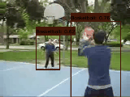

# CTAMIL-Net:Convolutional Temporal Attention and Multiscale Information Learning for  Spatio-Temporal Action Detection Networks

A Convolutional Temporal Attention and Multi-scale Information Learning network for Spatio-Temporal Action Detection (CTAMIL-Net) is proposed, aiming to solve the problem of inaccurate action detection caused by subtle changes in movements and similar representations of different actions.The algorithm proposed in this paper achieves superior performance results compared to existing advanced methods on the datasets UCF24, AVA, and the self-constructed Thermal Discomfort Action dataset (TDA).Big thanks to [YOWO](https://github.com/wei-tim/YOWO) for their open source. 

# Algorithm Framework


# Requirements
- We recommend you to use Anaconda to create a conda environment:
```Shell
conda create -n yowo python=3.6
```

- Then, activate the environment:
```Shell
conda activate yowo
```

- Requirements:
```Shell
pip install -r requirements.txt 
```

# Visualization




# Dataset
You can download **UCF24**  from the following links:

## UCF101-24:
* Google drive

Link: https://drive.google.com/file/d/1Dwh90pRi7uGkH5qLRjQIFiEmMJrAog5J/view?usp=sharing

* BaiduYun Disk

Link: https://pan.baidu.com/s/11GZvbV0oAzBhNDVKXsVGKg

Password: hmu6 

## AVA
You can use instructions from [here](https://github.com/yjh0410/AVA_Dataset) to prepare **AVA** dataset.


## Train YOWO
* UCF101-24

```Shell
python train.py --cuda -d ucf24 -v yowo --num_workers 4 --eval_epoch 1 --eval
```

or you can just run the script:

```Shell
sh train_ucf.sh
```

##  Test YOWO
* UCF101-24
For example:

```Shell
python test.py --cuda -d ucf24 -v yowo --weight path/to/weight --show
```

## Evaluate YOWO
* UCF101-24
For example:

```Shell
# Frame mAP
python eval.py \
        --cuda \
        -d ucf24 \
        -v yowo \
        -bs 8 \
        -size 224 \
        --weight path/to/weight \
        --cal_frame_mAP \
```

## Demo
```Shell
# run demo
python demo.py --cuda -d ucf24 -v yowo -size 224 --weight path/to/weight --video path/to/video
                      -d ava_v2.2
```